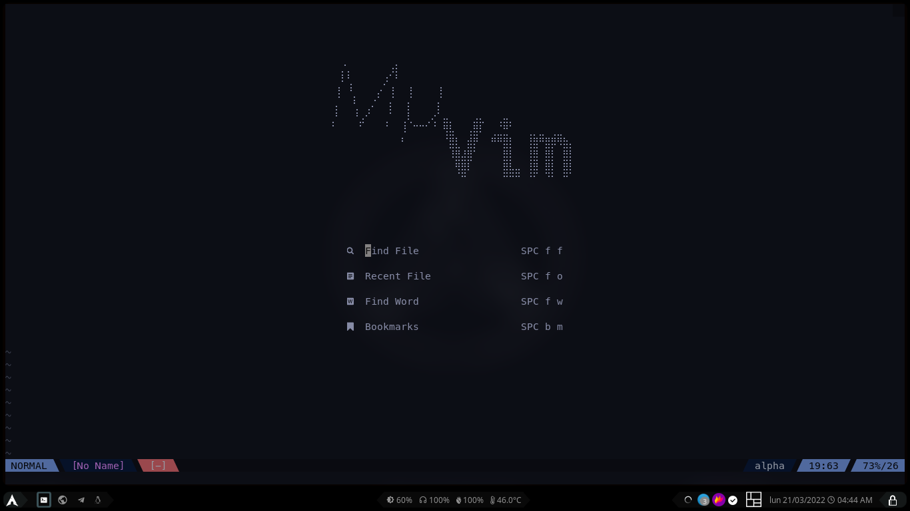
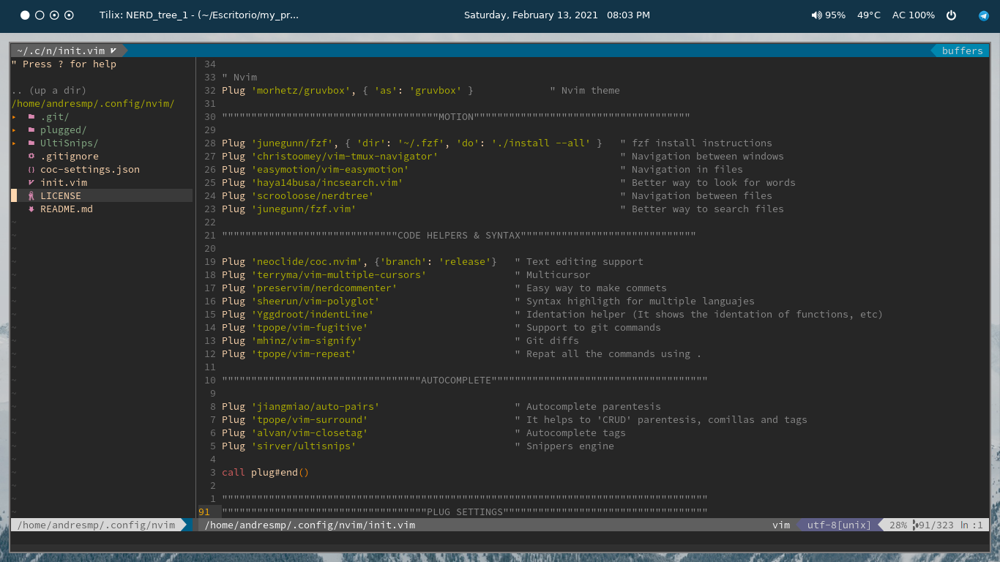
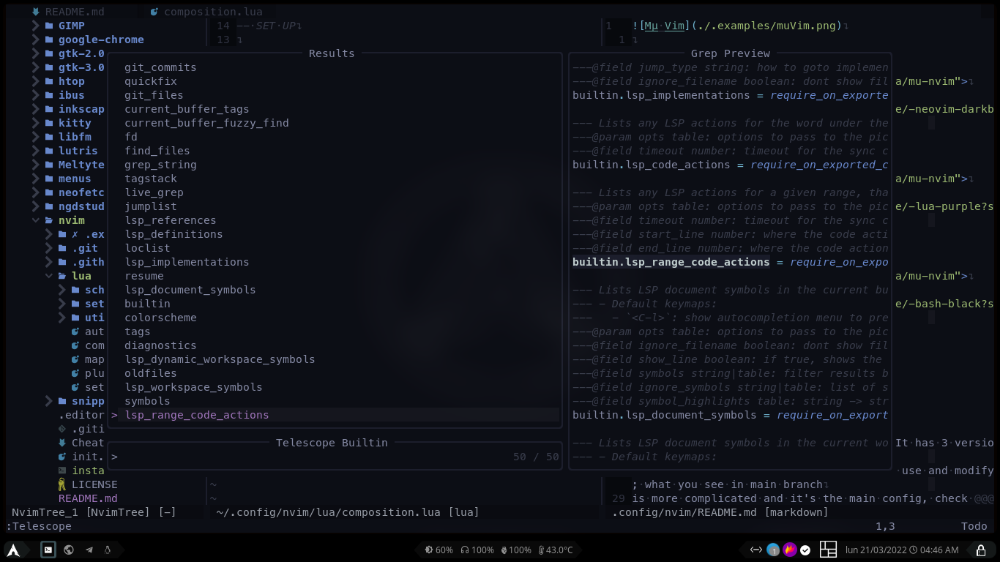
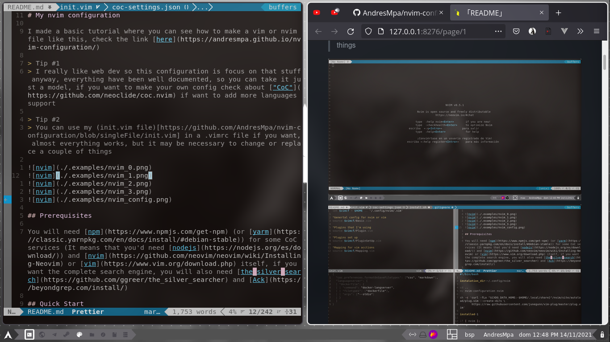
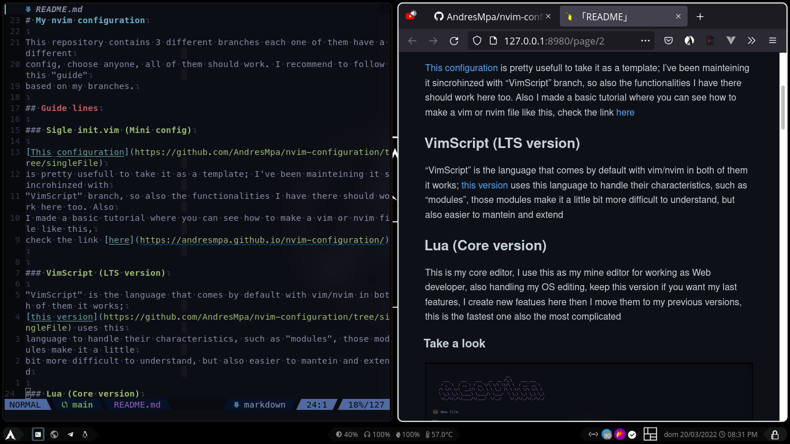

# My nvim configuration

I made a basic tutorial where you can see how to make a vim or nvim file like this, check the link [here](https://andresmpa.github.io/nvim-configuration/)

## Note:

Previous version using only one file can be [find here](https://github.com/AndresMpa/nvim-configuration/tree/singleFile), I'll mantein it for a while

> Tip #1
> I really like web dev so this configuration is focus on that stuff anyway, everything have been well documented, so you can take it just a model, if you want to make your own config check about ["CoC"](https://github.com/neoclide/coc.nvim) if want to add more languages support

> Tip #2
> You can use my (init.vim file)[https://github.com/AndresMpa/nvim-configuration/blob/singleFile/init.vim] in a .vimrc file if you want, almost everything works, but it may be necessary to change or replace a couple of things







[Example from YouTube](https://youtu.be/9L-k6n9SQds)

## Prerequisites

You will need [npm](https://www.npmjs.com/get-npm) (or [yarm](https://classic.yarnpkg.com/en/docs/install/#debian-stable)) for some CoC services (It means that you'd need [nodejs](https://nodejs.org/es/download/)) and [nvim](https://github.com/neovim/neovim/wiki/Installing-Neovim) or [vim](https://www.vim.org/download.php) itself, if you want the complete search engine, you will also need [the_silver_search](https://github.com/ggreer/the_silver_searcher) and [Ack](https://beyondgrep.com/install/), if you bash support install shfmt

## Quick Start

If you don't know to much about vim or nvim just follow the next steps:

### If you are using Linux or mac

```
git clone https://github.com/AndresMpa/My-NVIM-configuration.git
cd nvim-configuration/ && ./install.sh && exit
nvim
```

#### Note:

If you feel lost inside nvim or vim and you are using my config, just press "space + h + h"

Now you must being on neovim (or vim) just make the following commands to install the plugins and that stuff (You may need to install [Plug](https://github.com/junegunn/vim-plug))

- space + p + i
- esc
- :source%
- :CocInstall
- :call mkdp#util#install()

That's it, now it should work

---

## Future changes

- [x] Split this into files, my config is getting hard to mantein
- [ ] Improve documentation
- [ ] Add more helpers
- [ ] Create a new config using Lua

---

## Summary

| Color schema                          | Motion             | Code helpers and syntax | Autocomplete     | Tracking |
| ------------------------------------- | ------------------ | ----------------------- | ---------------- | -------- |
| gruvbox (Currently I'm using default) | vim-tmux-navigator | markdown-preview.nvim   | editorconfig-vim | wakatime |
| vim-airline-theme                     | vim-easymotion     | vim-multi-cursor-next   | vim-surround     |          |
| vim-devicons                          | incsearch.vim      | nerdcommenter           | vim-closetag     |          |
| vim-airline                           | nerdtree           | vim-css-color           | vim-snippets     |          |
|                                       | fzf.vim            | vim-polyglot            | vim-ultisnip     |          |
|                                       | ack.vim            | vim-fugitive            | auto-pairs       |          |
|                                       |                    | vim-signify             |                  |          |
|                                       |                    | indentLine              |                  |          |
|                                       |                    | vim-repeat              |                  |          |
|                                       |                    | sxhkd-vim               |                  |          |
|                                       |                    | vim-shfmt               |                  |          |
|                                       |                    | coc.vim                 |                  |          |
|                                       |                    | kite IA                 |                  |          |
|                                       |                    | vCoolor                 |                  |          |

## Cheat sheet

### Native

> Note
> If you already know about vim or nvim, skip this until next "files" item; this is like a tutorial

#### Motion

| Action                                               | Command           |
| ---------------------------------------------------- | ----------------- |
| Move up (Add a number to jump # lines, default 1)    | #k or arrow up    |
| Move down (Add a number to jump # lines, default 1)  | #j or arrow down  |
| Move left (Add a number to jump # lines, default 1)  | #l or arrow left  |
| Move right (Add a number to jump # lines, default 1) | #h or arrow right |

#### Writting

| Action  | Command               |
| ------- | --------------------- |
| Insert  | i or a or o or s      |
| Replace | r or R                |
| Visual  | v                     |
| Copy    | y                     |
| Paste   | p or P                |
| Undo    | u                     |
| Delete  | x or #d + space or dd |
| Search  | # + n or /query + n   |

> Tip
> That's enough for beginners, skip until "Files" if you're lazy

#### Lines

| Action                                             | Command           |
| -------------------------------------------------- | ----------------- |
| Move to the end of a word # tines (Default 1)      | #e                |
| Move forward a number # of words (Default 1)       | #w                |
| Move backward a number # of words (Default 1)      | #b                |
| Move forward a WORD (any non-whitespace characters | W                 |
| Move the end of current line                       | $                 |
| Move to the beginning of the line                  | 0 or vertical bar |
| Move to the first non-blank character of the line  | ^                 |
| Move to # column                                   | # + Vertical bar  |

#### Jumping

| Action                                                | Command                       |
| ----------------------------------------------------- | ----------------------------- |
| Jump to beginning of file                             | gg or 1G                      |
| Jump to end of file                                   | G                             |
| Jump to any # line                                    | #G                            |
| Jump # screen lines in direction (up,down,left,right) | #g + direction {j, k, h, l}   |
| Move # pages up                                       | # + page up or # + ctrl + b   |
| Move # pages dowm                                     | # + page dowm or # + ctrl + f |
| Jump to the top of the screen                         | H                             |
| Jump to the middle of the screen                      | M                             |
| Jump to the bottom of the screen                      | B                             |
| Jump between sentences                                | ( or )                        |
| Jump between paragraph                                | { or }                        |
| Jump between closing brace                            | %                             |

#### Scrolling

| Action             | Command  |
| ------------------ | -------- |
| Scroll 50% up      | ctrl + d |
| Scroll 50% down    | ctrl + u |
| Scroll 100% up     | ctrl + f |
| Scroll 100% down   | ctrl + b |
| Scroll 1 line up   | ctrl + e |
| Scroll 1 line down | ctrl + y |

#### Marks

| Action                                                               | Command |
| -------------------------------------------------------------------- | ------- |
| Set mark x at the current cursor position                            | mx      |
| Jump to the beginning of the line of mark                            | 'x      |
| Jump to the cursor position of mark x                                | `x      |
| Return to the line where the cursor was before the latest jump       | "       |
| Return to the cursor position before the latest jump (undo the jump) | ``      |
| Jump to the last-changed line                                        | '.      |
| Jump to last edited                                                  | g;      |

---

#### Files

| Action                                     | Command            |
| ------------------------------------------ | ------------------ |
| Keep the file (Auto save can be activated) | space + w          |
| Quit nvim (or vim)                         | space + q          |
| History                                    | space + h          |
| Split                                      | space + v + j      |
| Vertical split                             | space + v + k      |
| Rezice                                     | space + { + or - } |

#### Buffers

> Tip
> Buffers are basically the files that you have opened; when you open a file it "appends" itself to a "queue", you can switch between those file like next, before and remove from this "queue" of opened files using the next commands

| Action                               | Command   |
| ------------------------------------ | --------- |
| Next file                            | space + j |
| Previous file                        | space + k |
| Delete the current file from buffers | space + h |

---

### Plugins (Can be edited)

> Note
> "Plug" is the plugin manager that I use to manage my plugins, it means that if you are using other, you will have to replace the commands in the next table

#### Plugin Manager

| Action  | Repeat each                                  | Command       |
| ------- | -------------------------------------------- | ------------- |
| Install | Each time you add a plugin                   | space + p + i |
| Clean   | Each time you remove a plugin                | space + p + c |
| Update  | At least once a year                         | space + p + u |
| Upgrade | When you remember to do it (I forget it too) | space + p + d |

#### Plugins

| Action                    | Command                   |
| ------------------------- | ------------------------- |
| Search words in the file  | / or ?                    |
| Replace content           | space + R                 |
| Move to a concrete letter | space + s + s             |
| Move to croncrete file    | space + s + f             |
| Open file folder          | space + n                 |
| Toggle file folder        | space + n + t             |
| Open current file folder  | space + n + c             |
| Search files anywhere     | space + f + f             |
| Search files by extention | space + f + t             |
| Moving with ACK           | space + a                 |
| Git init                  | space + g + i + i         |
| Git show                  | space + g + s + h         |
| Git blame                 | space + g + b + l         |
| Git commit                | space + g + c             |
| Git status                | space + g + s + t         |
| Git add --all             | space + g + a + a         |
| Git remote -v             | space + g + r + v         |
| Git remote --add          | space + g + r + a         |
| Git pull origin dev       | space + g + p + l         |
| Git push origin dev       | space + g + p + s         |
| Git check + <branch>      | space + g + c + k         |
| Git check -b + <branch>   | space + g + n + b         |
| Git add some files        | space + g + c + c + a + a |
| Git pull a branch         | space + g + c + c + p + l |
| Git push a branc          | space + g + c + c + p + s |

## Apps

There's a couple of apps I recommend you to improve a little bit more your velocity, they are:

- [rofi](https://github.com/davatorium/rofi)
- [Ulauncher](https://ulauncher.io/)
- [Zeal](https://zealdocs.org/)
- [Vimium](https://addons.mozilla.org/es/firefox/addon/vimium-ff/?utm_source=addons.mozilla.org&utm_medium=referral&utm_content=search)
- [Arch Linux](https://github.com/AndresMpa/dotfiles)

## Pats on the back

If you are reading this it means that you want to improve your velocity or you want to make your own things so, if you start by nvim or vim It may by a little bit complicated but just at the beginning them you'll look like a professional "Ninja Dev"
