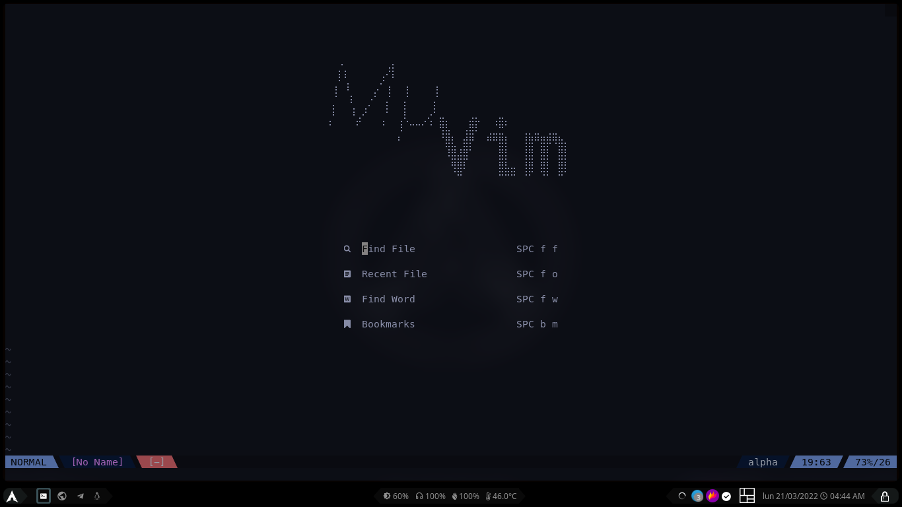
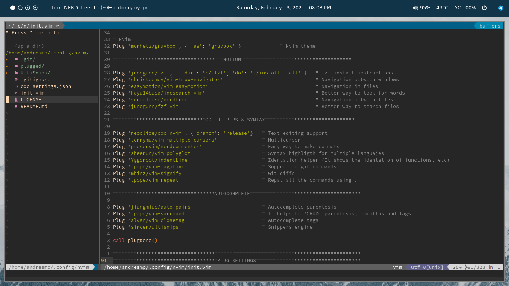
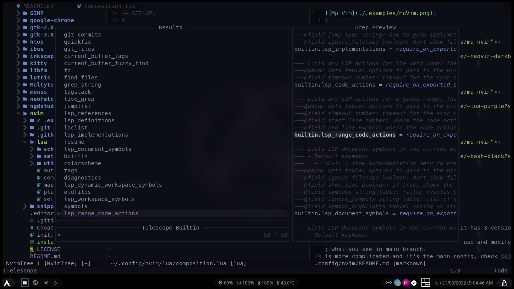
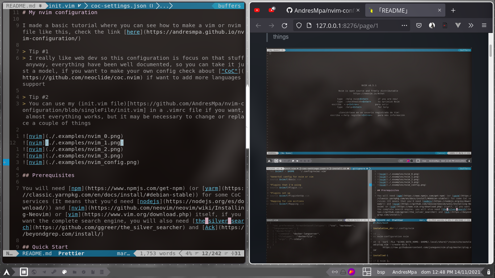
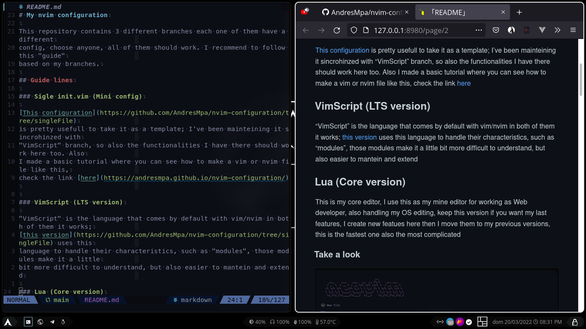

<div align="center">
  <p>
    <a href="https://github.com/AndresMpa/mu-nvim">
      
    </a>
    <a href="https://github.com/AndresMpa/mu-nvim">
      
    </a>
    <a href="https://github.com/AndresMpa/mu-nvim">
      
    </a>
  </p>
</div>

MμVim is three editor configs. This repository is **Current**: Lua, Neovim only, and where new work lands first.

The other two are [Mini](https://github.com/AndresMpa/mu-vim-mini) (one `init.vim`) and [VimScript](https://github.com/AndresMpa/mu-vim-vimscript) (modular Vim and Neovim). Docs for all three: [andresmpa.github.io/mu-vim-page](https://andresmpa.github.io/mu-vim-page/).

#### Take a look







## Prerequisites

[Neovim](https://github.com/neovim/neovim/wiki/Installing-Neovim) and [Lua](https://www.lua.org/download.html) (`lua`, `lua5.4`, or `luajit`). Current does not run on Vim. The installer pulls the rest.

## Quick Start

| OS | Package manager | Config dir |
| --- | --- | --- |
| Linux Arch / Manjaro | pacman | `~/.config/nvim` |
| Linux Debian / Ubuntu | apt | `~/.config/nvim` |
| Linux Fedora / RHEL | dnf | `~/.config/nvim` |
| macOS | [Homebrew](https://brew.sh) | `~/.config/nvim` |
| Windows | [winget](https://aka.ms/getwinget) | `%LOCALAPPDATA%\nvim` |

Linux and macOS:

```
git clone https://github.com/AndresMpa/mu-vim.git ~/.config/nvim
cd ~/.config/nvim && lua install.lua
nvim
```

On a Mac, install Homebrew first. The installer uses `brew install` and does not need sudo.

Windows:

```
cd %LOCALAPPDATA%
move nvim nvim_old
git clone https://github.com/AndresMpa/mu-vim.git nvim
cd nvim
lua install.lua
nvim
```

winget installs Neovim, Node LTS, pnpm, ripgrep, and fd. If Lua is missing, `winget install DEVCOM.Lua` and rerun `lua install.lua`.

The first `nvim` runs `:Pckr sync`. When it finishes, quit (`:qa`) and open `nvim` again. Later: `<Space> p i` (install) or `<Space> p u` (sync).

`:checkhealth` is the next step. Windows often needs a C compiler for Treesitter. Format (`Space f`): **black** for Python, **biome** for JS/TS/JSON/CSS, Prettier for HTML/Markdown/Vue/YAML, shfmt for shell, stylua for Lua.

## Uninstall

Removes the config, Mason, pckr, nvim cache/state, and the font `install.lua` copied. Leaves Neovim and Homebrew/apt packages.

```
cd ~/.config/nvim
lua delete.lua
```

On Windows, run `lua delete.lua` from `%LOCALAPPDATA%\nvim`.

## Tests

```
./tests/run.sh
```

Podman if present, otherwise Docker. On the host: `cd tests && go test -count=1 -parallel 8 .` Mapping tests also cover Mini and VimScript.

## Star History

If the project is useful, a star on GitHub helps.

<p align="center">
  <a href="https://star-history.com/#AndresMpa/mu-vim&Date">
   <picture>
     <source media="(prefers-color-scheme: dark)" srcset="https://api.star-history.com/svg?repos=AndresMpa/mu-vim&type=Date&theme=dark" />
     <source media="(prefers-color-scheme: light)" srcset="https://api.star-history.com/svg?repos=AndresMpa/mu-vim&type=Date" />
     
   </picture>
  </a>
</p>

## Related tools

- [rofi](https://github.com/davatorium/rofi)
- [Ulauncher](https://ulauncher.io/)
- [Zeal](https://zealdocs.org/)
- [Vimium](https://addons.mozilla.org/firefox/addon/vimium-ff/)
- [Arch Linux](https://github.com/AndresMpa/dotfiles)

## Similar projects

- [DoomVim](https://github.com/NTBBloodbath/doom-nvim)
- [NvChad](https://github.com/NvChad/NvChad)
- [LunarVim](https://github.com/LunarVim/LunarVim)

<div align="center">
  <p>
    Thanks to @jx11r for documentation.
  </p>
</div>
